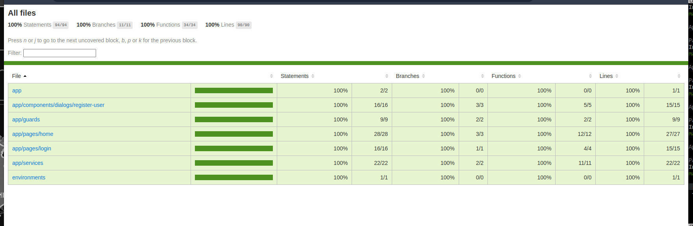
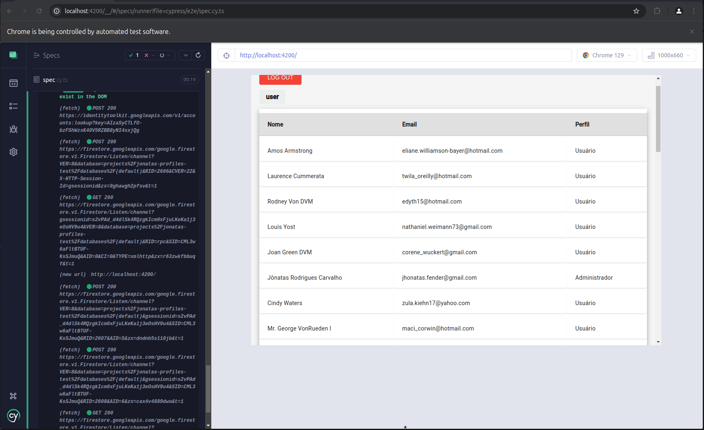

# Perfis Project

This project is a web application developed with **Angular** for user profile management.

## Prerequisites

- **Node.js** (recommended minimum version: 20.x)
- **NPM** (Node Package Manager)

## Installing Node.js

1. Download and install Node.js from the official website: [Node.js](https://nodejs.org).
2. After installation, verify that Node.js and NPM are correctly installed by running the following commands:

   ```bash
   node -v
   npm -v
   ```

## Installing the Project

To set up the project locally, follow these steps:

1. Clone the project repository:

   ```bash
   git clone <REPOSITORY_URL>
   ```

2. Navigate to the project directory:

   ```bash
   cd project-perfis
   ```

3. Install the project dependencies:

   ```bash
   npm install
   ```

## Running the Application

To start the development server, run the following command:

```bash
npm start
```

The application will be accessible at `http://localhost:4200/`.

## Running Unit Tests

This project uses **Karma** and **Jasmine** for unit testing and code coverage.

To run the tests and generate a coverage report:

1. Execute the following command to run the unit tests:

   ```bash
   npm run test
   ```

2. After the tests finish, a coverage report will be generated in the `coverage/` directory.

3. To view the coverage report in your browser, run:

   ```bash
   npx live-server coverage/project-perfis/
   ```

4. Open the `index.html` file in your browser to see the detailed test coverage report.

### Current Test Coverage

A snapshot of the current test coverage is displayed below:



Additionally, here is a GIF demonstrating the execution of end-to-end (e2e) tests, highlighting how errors are detected. This showcases the project's commitment to quality, emphasizing faster delivery with a high level of confidence.



## Project Structure

- **src/app**: Contains the core application components, services, and routing configuration.
- **src/assets**: Static assets, such as images and icons.
- **src/environments**: Environment-specific configuration files (e.g., for production and development environments).

## Improvement Opportunities

Although the project is well-structured and follows best practices in Angular architecture, there are some areas where improvements can be made to further enhance the quality and maintainability of the code:

1. **Test Coverage**: While there are unit and E2E tests, it's important to ensure that all critical scenarios are covered. Adding more **integration tests** and **service mocking** can increase confidence in the delivery and stability of the application.

2. **Error Handling**: The project could benefit from more robust **error handling**, especially for dealing with network failures, API calls, and inconsistent states. This can improve the user experience by ensuring appropriate and preventive feedback.

3. **Documentation**: Expanding the code documentation, especially for more complex methods and functions, could be helpful. This would facilitate understanding for new developers who might collaborate on the project.

4. **Performance**: Analyze the overall performance of the application and look for optimization opportunities. This could include improving the loading of heavy modules or enhancing the efficiency of API calls and component rendering.

5. **UX/UI**: The user interface can be refined to improve **usability**, providing **visual feedback** during loading operations and form submissions. Additionally, ensuring full **responsiveness** for different devices can enhance the overall user experience.
